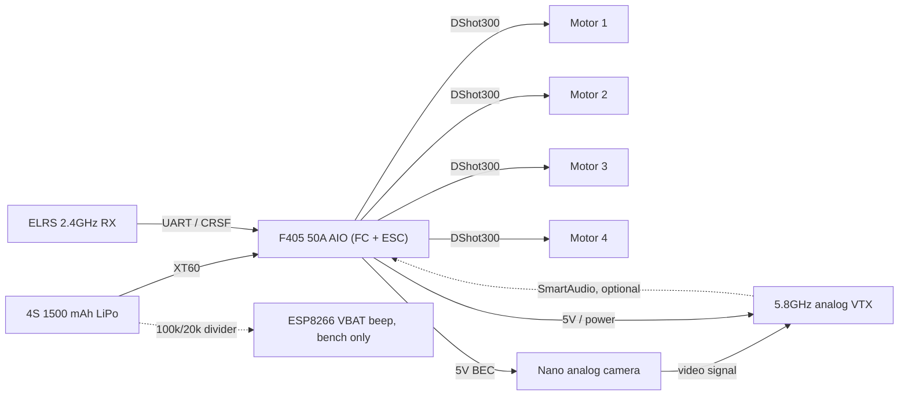

# 2 · Architecture

Pack → XT60 → AIO/stack → motors, 5 V cam, VTX (PIT), ELRS on UART.

DShot300/600, CRSF 250–500 Hz, analog 5.8. Keep RX and VTX antennas off the same arm.

## System diagram

## Interconnects

| Link | Protocol | Notes |
|---|---|---|
| AIO → motors | DShot300 (600 is a stretch target) | 4x 2207 1950KV |
| ELRS RX → AIO | CRSF over UART, ~250–500 Hz | TX/RX crossed |
| Camera → VTX | Analog composite video | Connector depends on the exact parts chosen |
| VTX ↔ AIO | SmartAudio (optional), shared UART TX | Only if the VTX supports it |
| Pack → ESP8266 | Resistive divider into A0 | Bench/bag only, not part of the flight harness |

## Antenna placement

Keep the ELRS (2.4 GHz) and VTX (5.8 GHz) antennas off the same arm. Close proximity
desenses the receiver on transmit — RX glitches or short-range VTX noise are the usual
symptom. Route them on opposite or diagonal arms and keep both clear of carbon.
