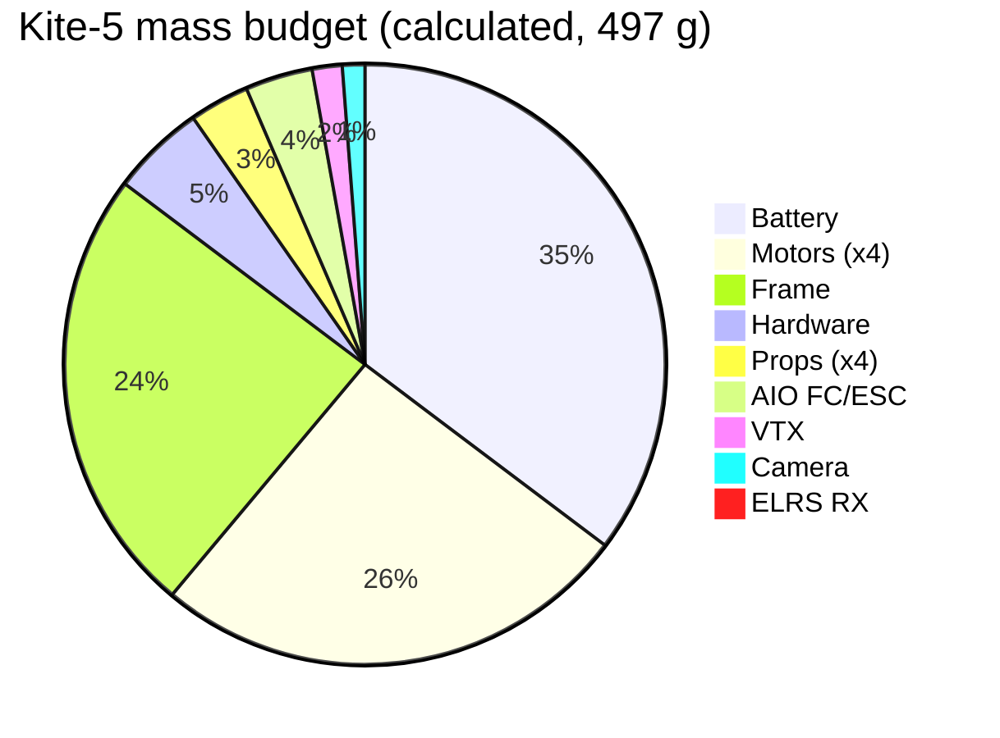

# 3 · Mass and power

Source of truth for parts/mass is [`6_BOM/kite5.json`](../6_BOM/kite5.json) — this page
shows example output of running the calculators, it does not duplicate the BOM table.

## Mass budget

```
$ kite5 mass
Kite-5  497 g   margin 153 g to 650 g
example INR  20020

item                         qty      g      INR
5-inch freestyle frame         1    120     2800
2207 1950KV                    4    128     5600
5in 3-blade (one prop)         4     16      320
F405 50A AIO                   1     18     4500
ELRS 2.4 RX                    1      1      900
5.8 analog VTX                 1      8     1800
Nano analog cam                1      6     1500
XT60, pads, screws             1     25      400
4S 1500 mAh                    1    175     2200
```



497 g vs the 650 g target leaves ~153 g of margin — typically spent on a heavier pack, a
GoPro-style action cam, or a cinewhoop-style ducted frame.

## Hover power

Induced hover power: `P_i = T^1.5 / sqrt(2 * ρ * A_total)`, then divided by figure-of-merit
≈ 0.65 to get electrical power. See [`kite5/hover_power.py`](../kite5/hover_power.py) /
`kite5 hover --thrust-g 650 --disk-cm 12.7`.

**Assumptions and limits:** static hover only (no forward flight, no ground effect), no
battery sag modeled, figure-of-merit is a textbook estimate (0.65) not a measured value for
this prop/motor combo. Treat the output as a sizing estimate, not a guarantee.
