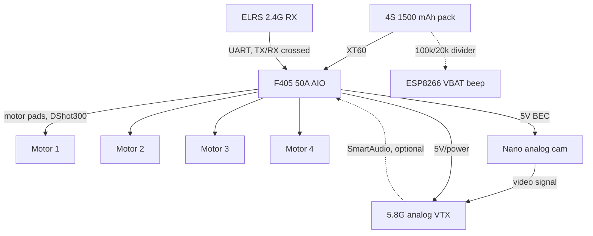

# 4 · Wiring

XT60 on the AIO. ELRS on a UART (TX/RX crossed). VTX SmartAudio if present. First power-up
in PIT. Optional ESP8266 VBAT nag in [`firmware/`](../firmware/esp8266_vbat_beep/README.md).

## Harness diagram

## Connectors

| From | To | Connector | Notes |
|---|---|---|---|
| Pack | AIO | XT60 | Main power |
| AIO | Motors | Bare solder pads | DShot300, confirm motor order against §5 |
| ELRS RX | AIO | UART pins | TX/RX crossed |
| AIO | VTX | Power + video | SmartAudio on shared UART TX, if supported |
| Pack tap | ESP8266 A0 | 100k / 20k divider | Bench/bag only, not part of the flight harness |

## Power-up procedure (planned)

No hardware exists yet — this is the intended first-power-up sequence, not a report of one
already performed:

1. Props off.
2. Confirm VTX is in PIT mode before applying power.
3. Bind ELRS, verify failsafe behavior.
4. Check DShot motor-direction beacons match §5's layout before props ever go on.
5. Only then, first prop-on test — throttle low, hand on the disarm switch.
