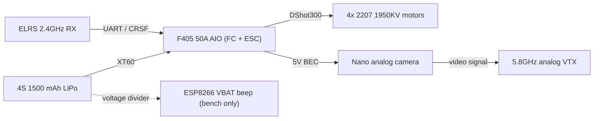

[](LICENSE)
[](https://github.com/Geneticscrol/openbom-drone/actions/workflows/ci.yml)


# OpenBOM-Drone — Kite-5 reference 5-inch airframe

Engineering package for a **5-inch, 4S, analog + ELRS** freestyle / trainer quad.

This is not a shopping website. The repo is the design: mass budget, power estimate,
harness, Betaflight resource map, and small pieces of code you can run or flash.

> **Status: design / pre-build.** No physical Kite-5 exists yet. Every number below is
> calculated or planned, not measured or flown. Sections say so explicitly where it
> matters — treat anything that isn't marked "measured" as a design target.

## Airframe

| Item | Choice |
|---|---|
| Class | 5-inch quad, X mix |
| Battery | 4S 1300–1500 mAh LiPo |
| Target AUW | ≤ 650 g with pack |
| Control | ELRS 2.4 GHz |
| Video | Analog 5.8 GHz, PIT on the bench |
| FC | F4/F7 AIO or stack, Betaflight |

Not an armed airframe.

## System overview



Full interconnect detail, including protocol/rate table and antenna placement, lives in
[`2_Architecture/`](2_Architecture/README.md).

## Repository layout

| Path | Contents |
|---|---|
| [`1_Project_Description/`](1_Project_Description/README.md) | Goals, non-goals, success criteria |
| [`2_Architecture/`](2_Architecture/README.md) | System block diagram, protocol/interconnect table |
| [`3_Mass_and_Power/`](3_Mass_and_Power/README.md) | Mass budget, hover power estimate |
| [`4_Wiring_and_Harness/`](4_Wiring_and_Harness/README.md) | Harness diagram, connector table, power-up checklist |
| [`5_Flight_Controller/`](5_Flight_Controller/README.md) | Betaflight resource map, motor/mixer layout |
| [`6_BOM/`](6_BOM/README.md) | `kite5.json` — single source of truth for parts, mass, price |
| [`kite5/`](kite5/) | Installable Python package: mass/hover/mixer calculators |
| [`firmware/`](firmware/esp8266_vbat_beep/README.md) | ESP8266 pack-voltage beep (PlatformIO) |
| [`tests/`](tests/) | pytest suite for `kite5/` |

## Getting started

### Run the calculators

```bash
pip install -e ".[dev]"
kite5 mass                                        # BOM mass/cost totals
kite5 hover --thrust-g 650 --disk-cm 12.7          # induced hover power estimate
kite5 mixer --throttle 0.5 --roll 0.2 --pitch 0 --yaw 0   # QUADX stick-to-motor reference
```

Or run the modules directly without installing:
`python kite5/mass_budget.py`, `python kite5/hover_power.py --thrust-g 650 --disk-cm 12.7`.

### Build and flash the firmware

See [`firmware/esp8266_vbat_beep/README.md`](firmware/esp8266_vbat_beep/README.md) —
requires [PlatformIO](https://platformio.org/).

## BOM

[`6_BOM/kite5.json`](6_BOM/kite5.json) is the only BOM dataset in this repo — see
[`6_BOM/README.md`](6_BOM/README.md). INR figures are order-of-magnitude, not live shop
prices.

## Contributing

See [`CONTRIBUTING.md`](CONTRIBUTING.md) for local setup, code standards, and how to
propose a BOM or doc change. Please read the [Code of Conduct](CODE_OF_CONDUCT.md).

## License

MIT. A hardware-specific license (e.g. CERN-OHL-P) may be added once real CAD/schematics
exist — premature while the airframe is design-only.
